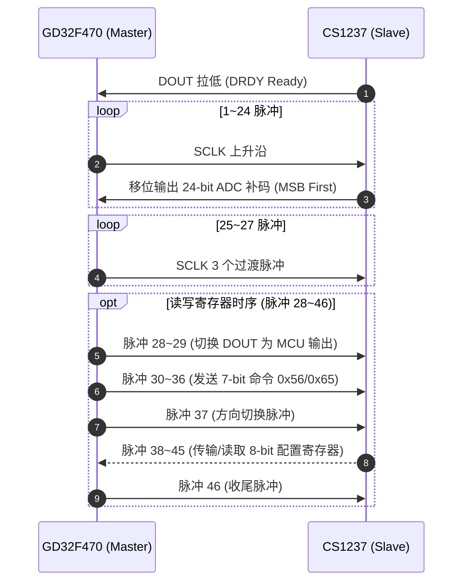

# CS1237 24-Bit ADC 外设驱动开发与协议使用说明

本文档针对 **GD32F470** 主控芯片上集成的 **CS1237 高精度 24 位 Sigma-Delta 模数转换器 (ADC)** 驱动进行详细的技术协议说明、时序分析、API 使用指南及 FreeRTOS 任务集成说明。

---

## 一、 芯片概述与硬件物理连接

### 1.1 CS1237 芯片特性
* **分辨率**：24-Bit 无失码高精度 ADC。
* **PGA 增益**：集成低噪声可编程增益放大器，支持 **1X, 2X, 64X, 128X** 四种增益。
* **数据输出速率**：支持 **10Hz, 40Hz, 640Hz, 1280Hz** 四档速率。
* **输入通道**：支持差分信号输入通道 A、内部温度传感器通道、内部短路校准通道。
* **通信接口**：自定义双线串行总线（SCLK 时钟线 + DOUT/DRDY 双向数据/就绪线）。

### 1.2 GD32F470 引脚分配

| CS1237 信号 | GD32F470 引脚 | GPIO 模式 | 描述 |
| :--- | :--- | :--- | :--- |
| **SCLK** | **GPIOC Pin 6 (PC6)** | 推挽输出 (Push-Pull, 50MHz) | 时钟信号驱动线 |
| **DOUT / DRDY** | **GPIOC Pin 7 (PC7)** | 上拉双向 (Input/Output Bi-directional) | 兼作数据输出线与数据就绪指示线 |

---

## 二、 通信协议与脉冲时序规范 (Protocol & Timing)

CS1237 的总线通信全靠 SCLK 的时钟脉冲个数控制：



### 2.1 数据读取脉冲时序 (27 Clock Pulses)
1. **DRDY 检测**：MCU 监视 DOUT 引脚。当 DOUT 为高电平时，表示芯片正在转换；**当 DOUT 拉低时**，表示数据准备就绪。
2. **24 位数据移位 (脉冲 1~24)**：MCU 产生 24 个 SCLK 高低电平脉冲，在每个 SCLK 高电平期间读取 DOUT 引脚电平，组合成 24 位最高有效位先出（MSB First）的 ADC 补码。
3. **状态保留脉冲 (脉冲 25~27)**：连续送出 3 个 SCLK 脉冲，完成一次标准的 27 脉冲数据读取循环。

### 2.2 寄存器读写脉冲时序 (46 Clock Pulses)
当需要读取或修改 CS1237 的增益、速率或通道配置时，需扩展至 46 个 SCLK 脉冲：

| 脉冲区间 | 传输方向 | 功能说明 |
| :--- | :--- | :--- |
| **脉冲 1 ~ 24** | CS1237 $\rightarrow$ MCU | 输出 24 位 ADC 采样数据 |
| **脉冲 25 ~ 27** | MCU $\rightarrow$ CS1237 | 过渡准备脉冲 |
| **脉冲 28 ~ 29** | MCU $\rightarrow$ CS1237 | 将 DOUT 设置为 MCU 输出模式，送出 2 个低电平过渡脉冲 |
| **脉冲 30 ~ 36** | MCU $\rightarrow$ CS1237 | 移位发送 7 位控制命令（**读寄存器命令 `0x56`** 或 **写寄存器命令 `0x65`**） |
| **脉冲 37** | MCU / CS1237 | 读写过渡脉冲（读模式下，MCU 在此脉冲将 DOUT 切换回输入模式） |
| **脉冲 38 ~ 45** | MCU $\leftrightarrow$ CS1237 | 读模式下接收 8 位寄存器值；写模式下发送 8 位新配置字节 |
| **脉冲 46** | MCU $\rightarrow$ CS1237 | 结束与收尾脉冲 |

---

## 三、 配置寄存器映射 (Register Map)

CS1237 内部包含一个 8-Bit 的配置寄存器：

| Bit 7 | Bit 6 | Bit 5 | Bit 4 | Bit 3 | Bit 2 | Bit 1 | Bit 0 |
| :---: | :---: | :---: | :---: | :---: | :---: | :---: | :---: |
| Reserved | REFO_OFF | SPEED[1] | SPEED[0] | PGA[1] | PGA[0] | CH_SEL[1] | CH_SEL[0] |

* **Bit 7**：保留位（固定写 0）。
* **Bit 6 (`REFO_OFF`)**：内部参考电压基准输出控制。
  * `0`：开启内部参考电压输出 (VREF Active)
  * `1`：关闭内部参考电压输出 (高阻态)
* **Bits 5-4 (`SPEED`)**：数据输出速率控制。
  * `00`: **10 Hz** (默认，高精度降噪) | `01`: **40 Hz** | `10`: **640 Hz** | `11`: **1280 Hz**
* **Bits 3-2 (`PGA`)**：可编程增益放大器档位。
  * `00`: **1X** | `01`: **2X** | `10`: **64X** | `11`: **128X** (默认，最高灵敏度)
* **Bits 1-0 (`CH_SEL`)**：输入通道选择。
  * `00`: **通道 A** 差分输入 (AINP - AINN)
  * `10`: **内部温度传感器**
  * `11`: **内部短路校准**

---

## 四、 驱动 API 接口设计与使用说明

驱动存放在 [bsp_cs1237.h](file:///d:/code/testController/testController/test_v2/User/bsp_cs1237.h) 与 [bsp_cs1237.c](file:///d:/code/testController/testController/test_v2/User/bsp_cs1237.c) 中：

### 4.1 基础驱动 API
* **`void cs1237_init(void)`**
  初始化 PC3 (SCLK) 与 PC2 (DOUT) 的 GPIO 时钟及模式，执行 200us 上电强行复位与校准序列。
* **`int32_t cs1237_read_adc_signed(uint8_t *success)`**
  等待 DOUT 下降沿（带超时保护），读取 24 位 ADC 原始值，并自动完成 24 位到 32 位 C 语言有符号数的符号扩展（Sign Extension）。
* **`uint8_t cs1237_read_reg(void)` / `void cs1237_write_reg(uint8_t reg_val)`**
  实现完整的 46 脉冲命令时序，读写内部 8 位配置寄存器。
* **`void cs1237_configure(pga, speed, ch, vref)`**
  高层参数配置 API，自动组合寄存器字节并写入芯片。

### 4.2 智能自动量程与单位转换 API (Auto-Range)
* **`int32_t cs1237_read_adc_auto_range(uint8_t *success, cs1237_pga_t *out_pga)`**
  * **自动量程切换**：监控当前 ADC 读数的绝对值。当信号接近满量程（`>90%`）时自动降低 PGA 增益防止削顶溢出；当信号较小时自动提升 PGA 增益（最高 128X）提高分辨率。
  * 自动完成增益重新配置与过渡帧丢弃。
* **`float cs1237_raw_to_voltage_mv(int32_t raw_val, cs1237_pga_t pga, float vref_volts)`**
  根据当前 PGA 增益 multiplier 和参考电压（如 3.3V），将 24 位 ADC 原始 Code 精确换算为实际毫秒/微伏（mV / uV）电压值：
  $$\text{FullScale\_mV} = \frac{V_{\text{REF}} \times 1000}{2 \times \text{PGA}}$$
  $$\text{Voltage\_mV} = \frac{\text{raw\_val}}{8,388,607} \times \text{FullScale\_mV}$$

---

## 五、 FreeRTOS 任务调度集成规范

在 [main.c](file:///d:/code/testController/testController/test_v2/User/main.c) 中，CS1237 运行于高优先级的独立 FreeRTOS 任务：

```c
static void app_task_cs1237(void *pvParameters) {
    uint8_t success = 0;
    int32_t adc_val = 0;
    cs1237_pga_t active_pga = CS1237_PGA_128X;
    float voltage_mv = 0.0f;

    /* 启动时打印 CS1237 寄存器配置状态 */
    printf("CS1237 Register Read Code: 0x%02X\r\n", cs1237_read_reg());

    for (;;) {
        /* 自动量程采样 */
        adc_val = cs1237_read_adc_auto_range(&success, &active_pga);
        if (success) {
            voltage_mv = cs1237_raw_to_voltage_mv(adc_val, active_pga, 3.3f);
            printf("[CS1237 Auto-Range] Gain: %3dX | Raw: %8d | Voltage: %9.4f mV\r\n",
                   cs1237_get_pga_multiplier(active_pga), (int)adc_val, voltage_mv);
        }

        vTaskDelay(pdMS_TO_TICKS(100)); // 每 100ms 采样一次
    }
}
```

在 `main()` 函数中完成初始化并启动任务（**任务优先级 6**，高于网络与 LED 任务）：
```c
cs1237_init();
xTaskCreate(app_task_cs1237, "CS1237Task", 512, NULL, 6, NULL);
```

---

## 六、 调试与故障排查清单 (Troubleshooting)

1. **读取数据全是 0xFFFFFF 或 0x000000**：
   * 检查 PC3 (SCLK) 和 PC2 (DOUT) 硬件接线是否正确。
   * 检查 CS1237 VDD 供电电压（建议 3.3V 或 5.0V）是否正常。
2. **串口提示 `ADC Read Timeout / DRDY Not Ready`**：
   * CS1237 采样速率设置为 10Hz 时，两次数据就绪间隔约为 100ms。若在极短时间内连续密集调用 `cs1237_read_adc_raw()` 容易触发 DRDY 未就绪超时保护，建议采样间隔 $\ge 100\text{ms}$。
