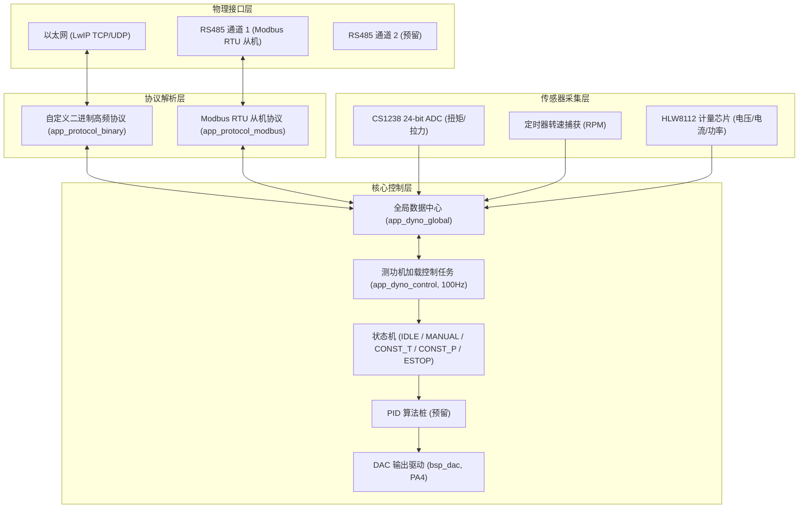

# GD32F470 测功机控制系统双协议架构与通信规范文档

本文档为基于 **GD32F470** 主控芯片的测功机（Dynamometer）系统提供完整的软件架构说明、高频二进制协议规范、RS485 Modbus RTU 寄存器映射及下位机加载控制逻辑指南。

---

## 1. 软件架构设计概述

系统运行于 **FreeRTOS V10** 实时操作系统之上，采用数据中心（`app_dyno_global`）解耦通信层、采样层与闭环加载控制层：



---

## 2. 硬件外设与 MCU 引脚连接映射表

系统基于 **GD32F470ZGT6** 主控（立创·梁山派开发板），各外设芯片与片上功能引脚连接分配如下：

| 外设芯片 / 模块 | 信号引脚 | GD32F470 引脚 | 模式 / 复用功能 | 功能说明 |
| :--- | :--- | :--- | :--- | :--- |
| **LAN8720A / LAN8702**<br>(10/100M 以太网 PHY) | REFCLK | **PA1** | AF11 (`ETH_RMII_REF_CLK`) | 50MHz 参考时钟输入 (板载晶振) |
| | MDIO | **PA2** | AF11 (`ETH_MDIO`) | SMI 串行管理数据总线 |
| | CRS_DV | **PA7** | AF11 (`ETH_RMII_CRS_DV`) | 载波监听 / 接收数据有效 |
| | MDC | **PC1** | AF11 (`ETH_MDC`) | SMI 串行管理时钟总线 |
| | RXD0 | **PC4** | AF11 (`ETH_RMII_RXD0`) | RMII 接收数据线 0 |
| | RXD1 | **PC5** | AF11 (`ETH_RMII_RXD1`) | RMII 接收数据线 1 |
| | TX_EN | **PB11** | AF11 (`ETH_RMII_TX_EN`) | RMII 发送使能 |
| | TXD0 | **PB12** | AF11 (`ETH_RMII_TXD0`) | RMII 发送数据线 0 |
| | TXD1 | **PB13** | AF11 (`ETH_RMII_TXD1`) | RMII 发送数据线 1 |
| **CS1238**<br>(24位双通道 ADC) | SCLK | **PD8** | 输出 (`GPIO_MODE_OUTPUT`) | 2-Wire 串行时钟线 |
| | DOUT / DRDY | **PD9** | 双向 (`GPIO_MODE_INPUT` / `OUTPUT`) | 数据输出 / 准备就绪指示 |
| **CS1237**<br>(24位单通道 ADC) | SCLK | **PC6** | 输出 (`GPIO_MODE_OUTPUT`) | 2-Wire 串行时钟线 |
| | DOUT / DRDY | **PC7** | 双向 (`GPIO_MODE_INPUT` / `OUTPUT`) | 数据输出 / 准备就绪指示 |
| **HLW8112**<br>(单相交流电计量芯片) | CS | **PB5** | 输出 (`GPIO_MODE_OUTPUT`) | 软件 SPI 片选 (低电平有效) |
| | SCLK | **PB6** | 输出 (`GPIO_MODE_OUTPUT`) | 软件 SPI 时钟信号 |
| | SDI (MOSI) | **PB7** | 输出 (`GPIO_MODE_OUTPUT`) | 主机发送数据输入 |
| | SDO (MISO) | **PB8** | 输入 (`GPIO_MODE_INPUT`, 上拉) | 计量数据输出回读 |
| | EN / SEL | **PB9** | 输出 (`GPIO_MODE_OUTPUT`) | 芯片使能与 SPI 模式选择 |
| **DAC 模拟量加载控制** | DAC0_OUT0 | **PA4** | 模拟输出 (`GPIO_MODE_ANALOG`) | 测功机加载输出控制电压 (0~3.3V) |
| | DAC0_OUT1 | **PA5** | 模拟输出 (`GPIO_MODE_ANALOG`) | 备用 DAC 模拟量输出通道 |
| **调试串口 USART0** | TX / RX | **PA9 / PA10** | AF7 (`USART0_TX` / `RX`) | 调试日志打印 (115200 8-N-1) |
| **系统运行指示灯** | LED2 | **PD7** | 输出 (`GPIO_MODE_OUTPUT`) | FreeRTOS 心跳指示灯 (500ms 翻转) |

---

## 3. 方案 A：以太网自定义高频二进制协议规范

* **字节序说明**：帧头及 Payload 中的 16/32 位整数与单精度浮点数遵循 Intel 小端模式 (Little Endian)，`Len` 字段为大端模式 (Big Endian)。
* **校验算法**：采用标准 **CRC16-Modbus** 算法（多项式 `0xA001`，初始值 `0xFFFF`）。

### 3.1 数据帧格式

| 偏移 (Bytes) | 字段名 | 类型 | 说明 |
| :---: | :--- | :---: | :--- |
| `0 ~ 1` | **Header** | `uint16_t` | 固定同步字 `0x55 0xAA` |
| `2` | **Cmd ID** | `uint8_t` | 功能码 |
| `3` | **Seq** | `uint8_t` | 帧序号 (`0x00 ~ 0xFF` 循环递增) |
| `4 ~ 5` | **Length** | `uint16_t` | Payload 长度 (大端) |
| `6 ~ N` | **Payload** | `bytes` | 业务数据 |
| `N+1 ~ N+2` | **CRC16** | `uint16_t` | Header 到 Payload 的 CRC16 (低字节在前) |

---

### 3.2 功能码定义列表

#### ① `0x01` - 实时测试数据主动上报帧（MCU $\rightarrow$ PC，50Hz）
Payload 尺寸：40 字节
```c
typedef struct __attribute__((packed)) {
    uint32_t timestamp_ms;    // 系统运行时间戳 (ms)
    uint8_t  work_mode;       // 当前模式 (0:Idle, 1:Manual, 2:Const_T, 3:Const_P, 4:EStop)
    uint8_t  alarm_flags;     // 报警标志 (Bit0:超扭矩, Bit1:超速, Bit2:超温, Bit3:急停)

    float    torque_nm;       // 实际扭矩 (N·m)
    float    speed_rpm;       // 实际转速 (RPM)
    float    mech_power_w;    // 计算机械功率 (W)
    float    dac_voltage;     // 当前 DAC 实时输出电压 (V)

    float    elec_voltage;    // 被测电机电压 (V)
    float    elec_current;    // 被测电机电流 (A)
    float    elec_power;      // 被测电机电功率 (W)
    float    power_factor;    // 功率因数
    float    efficiency;      // 总效率 (%)
} proto_bin_telemetry_payload_t;
```

#### ② `0x10` - 设定工作模式与目标加载值（PC $\rightarrow$ MCU）
Payload 尺寸：5 字节
```c
typedef struct __attribute__((packed)) {
    uint8_t  target_mode;     // 目标模式: 1-Manual, 2-Const Torque, 3-Const Power
    float    target_value;    // 目标值 (手动模式为 DAC 电压 V; 恒扭矩为 N·m; 恒功率为 W)
} proto_bin_set_mode_payload_t;
```

#### ③ `0x11` - 紧急停止 (E-Stop)（PC $\rightarrow$ MCU）
Payload 尺寸：0 字节。MCU 收到后立即将 DAC 归零，切入 `DYNO_MODE_ESTOP` 状态。

#### ④ `0x12` - 设定 PID 参数 (预留)（PC $\rightarrow$ MCU）
Payload 尺寸：17 字节
```c
typedef struct __attribute__((packed)) {
    uint8_t  loop_type;       // 0-恒扭矩, 1-恒功率
    float    kp;              // 比例系数
    float    ki;              // 积分系数
    float    kd;              // 微分系数
    float    max_dac;         // DAC 上限电压 (V)
} proto_bin_set_pid_payload_t;
```

#### ⑤ `0x80` - 通用指令应答包（MCU $\rightarrow$ PC）
Payload 尺寸：2 字节
```c
typedef struct __attribute__((packed)) {
    uint8_t  reply_cmd_id;    // 被响应的功能码
    uint8_t  status_code;     // 0:成功, 1:模式非法, 2:超出范围, 3:校验错误
} proto_bin_ack_payload_t;
```

---

## 4. 方案 B：RS485 Modbus RTU 从机协议规范

* **波特率**：默认 `115200 8-N-1`
* **从机地址**：默认 `0x01`
* **浮点数表示**：每个单精度 `Float` (32-bit) 占用 2 个连续的 16 位寄存器（高字在低地址，即 Big-Endian Words）。

### 4.1 只读输入寄存器映射表 (Input Registers - 功能码 `0x04`)

| 寄存器地址 | 变量名称 | 类型 | 单位 | 描述 |
| :---: | :--- | :---: | :---: | :--- |
| `0x0000 - 0x0001` | **实时扭矩** | `Float 32` | N·m | CS1238 采样计算得到的转矩 |
| `0x0002 - 0x0003` | **实时转速** | `Float 32` | RPM | 测功机转速 |
| `0x0004 - 0x0005` | **机械功率** | `Float 32` | W | $P = T \times n / 9.549$ |
| `0x0006 - 0x0007` | **DAC 当前输出** | `Float 32` | V | 当前制动器控制电压 |
| `0x0008 - 0x0009` | **电机交流电压** | `Float 32` | V | HLW8112 采样电压 |
| `0x000A - 0x000B` | **电机交流电流** | `Float 32` | A | HLW8112 采样电流 |
| `0x000C - 0x000D` | **电机输入电功率**| `Float 32` | W | HLW8112 采样有功功率 |
| `0x000E` | **状态与报警字** | `Uint16` | - | Bit0:超扭矩, Bit1:超速, Bit2:急停 |

---

### 4.2 可读写保持寄存器映射表 (Holding Registers - 功能码 `0x03` / `0x06` / `0x10`)

| 寄存器地址 | 变量名称 | 类型 | 可选值/单位 | 描述 |
| :---: | :--- | :---: | :---: | :--- |
| `0x1000` | **控制模式** | `Uint16` | `0`:IDLE, `1`:MANUAL, `2`:CONST_T, `3`:CONST_P, `4`:ESTOP | 写入 `4` 触发急停 |
| `0x1001 - 0x1002` | **目标设定值** | `Float 32` | V / N·m / W | 根据模式不同代表 DAC(V) 或目标扭矩/功率 |
| `0x1003 - 0x1004` | **预留 PID $K_p$** | `Float 32` | - | 恒扭矩/恒功率 PID 比例系数 |
| `0x1005 - 0x1006` | **预留 PID $K_i$** | `Float 32` | - | 积分系数 |
| `0x1007 - 0x1008` | **预留 PID $K_d$** | `Float 32` | - | 微分系数 |
| `0x1009 - 0x100A` | **DAC 输出上限限制**| `Float 32` | V (默认 3.3V) | 安全硬件保护限制 |

---

## 5. 测功机控制任务与 PID 算法预留

### 5.1 控制状态机工作流程 (`app_dyno_control.c`)

控制任务运行于 **FreeRTOS 100Hz (10ms 周期)**，严格按如下逻辑控制物理 DAC (PA4) 输出：

1. **`DYNO_MODE_IDLE` (空闲/停止)**：
   - 目标 DAC 输出强制赋值为 `0.0V`。
2. **`DYNO_MODE_MANUAL` (开环手动模式)**：
   - 目标 DAC 输出直接等于 `target_value`（经 `max_dac_limit` 安全限幅）。
3. **`DYNO_MODE_CONST_TORQUE` (恒扭矩闭环模式)**：
   - 调用 `dyno_pid_calc_stub(0, target_value, torque_nm, 0.01f)` 计算输出。
   - *当前阶段预留桩接口*：后期可直接在 `dyno_pid_calc_stub` 中增加完整位置式/增量式 PID 计算逻辑。
4. **`DYNO_MODE_CONST_POWER` (恒功率闭环模式)**：
   - 调用 `dyno_pid_calc_stub(1, target_value, mech_power_w, 0.01f)` 计算输出。
5. **`DYNO_MODE_ESTOP` (急停保护状态)**：
   - 无论接收何种算法值，硬件 DAC 立刻清 0V，保障制动器与机械结构安全。

---

## 6. 测试与对接方法

1. **使用 Modbus Poll 调试工具**：
   - 连接 RS485 转换器，选择 `Modbus RTU`，Slave ID 设置为 `1`。
   - 读取 Input Registers (0x04) `Address: 0, Quantity: 15`，格式选择 `32-bit Float`，即可实时观察扭矩、转速、功率及电参量。
   - 写入 Holding Register `0x1000` 值为 `1`，`0x1001-0x1002` 写入 Float `1.5`，即可观察到 DAC (PA4) 输出 1.5V 直流控制电压。

2. **使用网络调试助手测试二进制协议**：
   - TCP Client 连接 GD32F470 IP 的 Port 8080，下发十六进制数据 `55 AA 10 01 00 05 01 00 00 80 3F CRC_L CRC_H`（模式切为 Manual 1，目标值 1.0V），观察 MCU 返回的 ACK 帧及连续的 50Hz `0x01` 报文。
