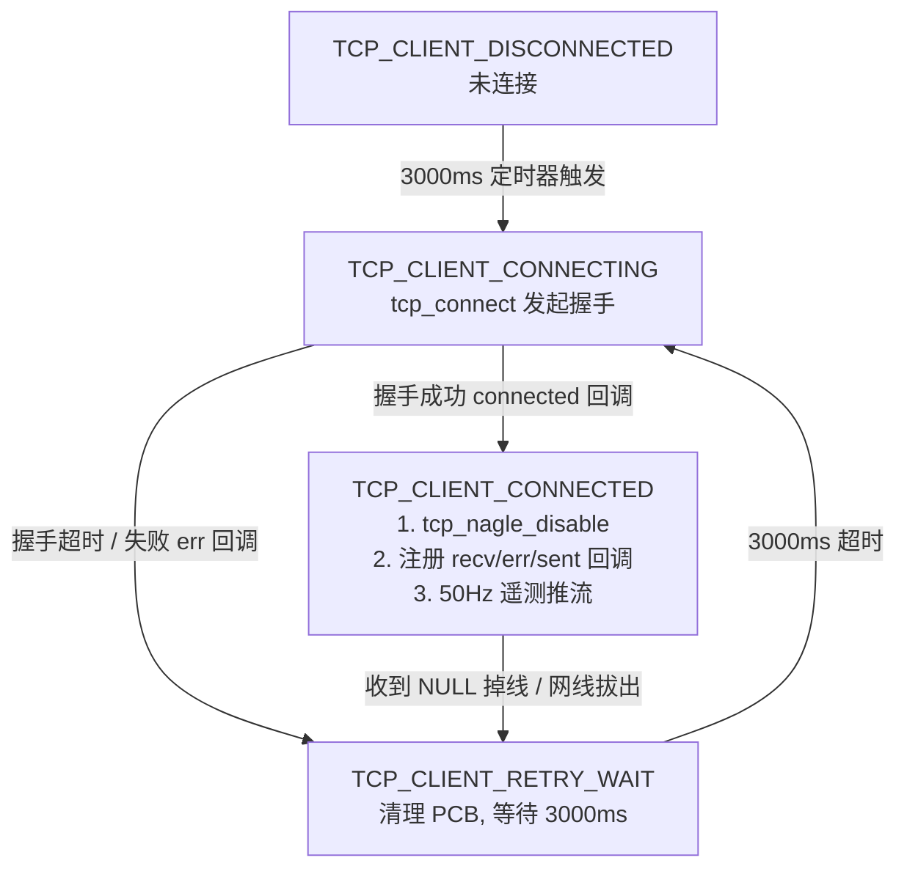

# GD32F470 LwIP 高速网络重构与多传感器数据链路集成开发文档

## 1. 项目概述与开发背景

在基于 **GD32F470** 的测功机台架控制系统中，系统承担着**高频控制 (100Hz PID)**、**多传感器高精测量 (24位 ADC + 交流计量)** 以及 **以太网 50Hz 低延迟遥测推流与控制** 的多重核心任务。

针对前期被动式 TCP Server 在局域网组网不便、Nagle 算法导致推流抖动、软件校验和占用 CPU 算力，以及传感器数据未贯通到以太网协议栈的问题，本次开发完成了：
1. **LwIP 协议栈网络层工业级专项调优**（硬件校验和卸载、禁用 Nagle、滑动窗口放大）；
2. **网络架构演进**：废除被动 TCP Server，重构为高可靠 **TCP Client 自动重连状态机**；
3. **传感器数据链路闭环打通**：将 **CS1237 (扭矩)**、**CS1238 (直流电压/电流)** 与 **HLW8112 (交流电力参量)** 完整注入全局数据中心；
4. **开发配套上位机中心服务端** (`dyno_server.py`)：实现 50Hz 零抖动接收与双向闭环控制。

---

## 2. 硬件传感器物理通道与功能映射

系统集成 3 颗高精度独立测量芯片，各通道分工与信号链路定义如下：

```mermaid
graph TD
    subgraph 物理传感器层
        S1["CS1237 (24位 ADC)<br>PF6:CLK, PF7:DOUT"]
        S2["CS1238 (双通道 24位 ADC)<br>PF6:CLK, PF9:DOUT"]
        S3["HLW8112 (SPI 计量芯片)<br>PB5~PB9: SPI总线"]
    end

    subgraph 测量参量与物理意义
        S1 -->|差分模拟采样| M1["机械扭矩 (Torque N.m)"]
        S2 -->|CH1 差分通道| M2["直流电压 (DC Voltage mV/V)"]
        S2 -->|CH2 差分通道| M3["直流电流 (DC Current mV/A)"]
        S3 -->|SPI 实时读取| M4["交流电压/电流/有功功率/PF/效率"]
    end

    subgraph 全局数据中心 (app_dyno_global)
        M1 --> D_MUTEX["线程安全互斥锁 (g_dyno_mutex)"]
        M2 --> D_MUTEX
        M3 --> D_MUTEX
        M4 --> D_MUTEX
        D_MUTEX --> D_SNAP["系统状态快照 (g_dyno_status)"]
    end

    subgraph 消费端应用
        D_SNAP --> TASK_PID["100Hz 闭环控制任务 (app_task_dyno_control)"]
        D_SNAP --> TASK_ETH["50Hz 以太网遥测任务 (app_task_network)"]
        D_SNAP --> TASK_485["Modbus RTU 触摸屏从机任务"]
    end
```

### 传感器功能分配表

| 硬件外设 | 芯片型号 | 引脚分配 | 测量物理量 | 采样特征 | 驱动文件 |
| :--- | :--- | :--- | :--- | :--- | :--- |
| **扭矩传感器** | **CS1237** | PF6 (CLK), PF7 (DOUT) | **机械扭矩 (N.m)** | 24位 $\Sigma-\Delta$ ADC，支持 128X PGA | `bsp_cs1237.c / .h` |
| **直流电参量** | **CS1238** | PF6 (CLK), PF9 (DOUT) | **CH1: 直流电压 (mV/V)**<br>**CH2: 直流电流 (mV/A)** | 双通道 24位 ADC，独立增益与通道切换 | `bsp_cs1238.c / .h` |
| **交流电参量** | **HLW8112** | PB5 (CS), PB6 (CLK), PB7 (MOSI), PB8 (MISO), PB9 (EN) | **交流电压 (V)、交流电流 (A)、有功功率 (W)、功率因数、效率 (%)** | 专用计量芯片，高频硬件积分 | `bsp_hlw8112.c / .h` |

---

## 3. LwIP 协议栈工业级高速与低延迟调优

### 3.1 优化项 1：彻底禁用 Nagle 算法（消除 40ms~200ms 抖动）
- **痛点**：默认 TCP 开启 Nagle 算法，小包（56 字节）必须等待上位机 ACK 或凑满 1460 字节才发出；上位机又启用了 Delayed ACK（延迟确认），两相死锁导致波形卡顿 40~200ms。
- **实施**：在客户端连接成功回调 `app_tcp_client_connected` 中调用：
  ```c
  tcp_nagle_disable(tpcb); /* 开启 TCP_NODELAY，小包即产即发 */
  ```

### 3.2 优化项 2：开启 GD32 MAC 硬件校验和全卸载（释放 75% CPU 算力）
- **实施**：
  1. 在 `lwipopts.h` 中配置宏：
     ```c
     #define CHECKSUM_BY_HARDWARE    1   /* 启用 MAC 硬件校验和 */
     #define CHECKSUM_GEN_IP         0   /* 关闭 LwIP 软件 IP 校验 */
     #define CHECKSUM_GEN_UDP        0   /* 关闭 LwIP 软件 UDP 校验 */
     #define CHECKSUM_GEN_TCP        0   /* 关闭 LwIP 软件 TCP 校验 */
     #define CHECKSUM_GEN_ICMP       0   /* 关闭 LwIP 软件 ICMP 校验 */
     #define CHECKSUM_CHECK_IP       0   /* 关闭 LwIP 软件接收校验 */
     #define CHECKSUM_CHECK_UDP      0
     #define CHECKSUM_CHECK_TCP      0
     ```
  2. 在 `bsp_lan8720.c` 初始化中配置 MAC 接收帧过滤与 DMA 发送描述符硬件自动填校验和：
     ```c
     enet_init(media_mode, ENET_AUTOCHECKSUM_ACCEPT_FAILFRAMES, ENET_BROADCAST_FRAMES_PASS);
     for (i = 0U; i < ENET_TXBUF_NUM; i++) {
         enet_transmit_checksum_config(&txdesc_tab[i], ENET_CHECKSUM_TCPUDPICMP_FULL);
     }
     ```

### 3.3 优化项 3：放大 TCP 滑动窗口与发送缓冲
- **实施**（`lwipopts.h`）：
  - `MEM_SIZE` 扩大至 **32KB**；
  - `PBUF_POOL_SIZE` 扩展至 **32**；
  - `TCP_SND_BUF` 放大至 **$8 \times \text{MSS} = 11680\text{ 字节}$**；
  - `TCP_WND` 放大至 **$8 \times \text{MSS} = 11680\text{ 字节}$**；
  - `TCP_SND_QUEUELEN` 扩充至 **32**。

---

## 4. 网络架构重构：TCP Client 自动重连状态机

### 4.1 状态机设计



### 4.2 核心接口与配置
- **目标服务器配置**（`tcp_client_app.h`）：
  ```c
  #define TCP_CLIENT_DEFAULT_SERVER_IP0   192
  #define TCP_CLIENT_DEFAULT_SERVER_IP1   168
  #define TCP_CLIENT_DEFAULT_SERVER_IP2   31
  #define TCP_CLIENT_DEFAULT_SERVER_IP3   73
  #define TCP_CLIENT_DEFAULT_SERVER_PORT  8080
  ```
- **动态修改服务器 API**：
  ```c
  void tcp_client_set_server(uint8_t ip0, uint8_t ip1, uint8_t ip2, uint8_t ip3, uint16_t port);
  ```
- **推流与大块数据回传 API**：
  ```c
  void tcp_client_send_telemetry(void); /* 50Hz 遥测帧推流 */
  bool tcp_client_send_sdram_burst_chunk(const uint8_t *chunk, uint16_t len, bool has_more); /* SDRAM 突发流控发送 */
  ```

---

## 5. 自定义二进制遥测协议规范 (0x55 0xAA)

### 5.1 50Hz 实时状态上报帧 (Cmd 0x01)
- **帧头**：`0x55 0xAA`
- **功能码**：`0x01`
- **帧序号**：`Seq` (0~255 循环累加)
- **Payload 长度**：`0x00 0x32` (50 字节)
- **Payload 结构体定义 (`proto_bin_telemetry_payload_t`)**：

| 偏移 (Offset) | 字段名称 | 类型 | 字节数 | 物理含义与来源 |
| :---: | :--- | :---: | :---: | :--- |
| `+0` | `timestamp_ms` | `uint32_t` | 4 | 系统运行时间戳 (ms) |
| `+4` | `work_mode` | `uint8_t` | 1 | 当前工作模式 (1:Manual, 2:Const Torque, 3:Const Power) |
| `+5` | `alarm_flags` | `uint8_t` | 1 | 报警标志位集合 (急停、过载等) |
| `+6` | `torque_nm` | `float` | 4 | **实际机械扭矩 (N.m，源自 CS1237)** |
| `+10` | `speed_rpm` | `float` | 4 | **实际旋转转速 (RPM)** |
| `+14` | `mech_power_w` | `float` | 4 | **计算机械功率 (W) = (Torque * Speed) / 9.549** |
| `+18` | `dac_voltage` | `float` | 4 | **当前 DAC 驱动电压 (0~10V)** |
| `+22` | `dc_voltage` | `float` | 4 | **直流电压 (mV/V，源自 CS1238 CH1)** |
| `+26` | `dc_current` | `float` | 4 | **直流电流 (mV/A，源自 CS1238 CH2)** |
| `+30` | `elec_voltage` | `float` | 4 | **交流电机电压 (V，源自 HLW8112)** |
| `+34` | `elec_current` | `float` | 4 | **交流电机电流 (A，源自 HLW8112)** |
| `+38` | `elec_power` | `float` | 4 | **交流有功功率 (W，源自 HLW8112)** |
| `+42` | `power_factor` | `float` | 4 | **功率因数 (源自 HLW8112)** |
| `+46` | `efficiency` | `float` | 4 | **机电综合转换效率 (%)** |
| `+50` | `crc16` | `uint16_t` | 2 | **CRC16-Modbus 校验和 (低字节在前)** |

总帧长：$2 + 1 + 1 + 2 + 50 + 2 = \mathbf{58\text{ 字节}}$。

---

## 6. 上位机测试服务端 (`dyno_server.py`) 使用指南

### 6.1 启动服务端
在电脑终端（本机 IP 如 `192.168.31.73`）上运行：
```bash
python dyno_server.py 8080
```

### 6.2 输出效果
当 GD32F470 单片机通电上线后，服务端将自动建立连接并实时打印结构化遥测数据：

```text
[+] 检测到测功机节点上线接入！节点地址: 192.168.31.119:4099
[+] TCP_NODELAY 已开启，开始 50Hz 低延迟零抖动推流接收...

[   32500ms | #00320 | 周期:20.0ms | 帧率:50.0Hz | MANUAL (开环手动DAC)]
   -> [机械] CS1237扭矩:  2.35 N.m | 转速:1500.0 RPM | 机械功率: 369.1 W | DAC:2.50 V
   -> [直流] CS1238电压:1200.50 mV | CS1238电流: 350.20 mV | 直流功率: 420.42 mW
   -> [交流] HLW8112电压:220.1 V | 电流: 1.82 A | 功率: 395.2 W | PF:0.98 | 效率:93.4%
```

### 6.3 交互控制命令

| 指令 | 参数 | 示例 | 功能说明 |
| :--- | :--- | :--- | :--- |
| `v` | 无 | `v` | **切换输出模式**：全量 50Hz 逐包打印 / 100ms 平滑流模式 |
| `m` | `<0~10V>` | `m 3.5` | 开环手动设定加载 DAC 电压 |
| `t` | `<N.m>` | `t 15.0` | 恒扭矩闭环加载设定 |
| `p` | `<W>` | `p 500.0` | 恒功率闭环加载设定 |
| `pid` | `<0/1> <p> <i> <d>` | `pid 0 0.5 0.05 0.01` | 在线调整扭矩环/功率环 PID 参数 |
| `e` | 无 | `e` | **紧急停机 (E-STOP)** |
| `q` | 无 | `q` | 退出中心服务器 |

---

## 7. 任务调度与采样率进阶调优建议

为保证 50Hz 以太网传输的每个数据包都是最新的独立物理点，建议将底层传感器采样率与 FreeRTOS 任务调度匹配如下：

```c
/* 建议任务周期与速率配置 */
app_task_dyno_control : 10ms 周期 (100Hz PID 闭环)
app_task_network      : 20ms 周期 (50Hz 以太网推流，自适应 1ms 突发回传)
app_task_cs1237       : 20ms 周期 (芯片配置 640Hz，单次转换 1.56ms)
app_task_cs1238       : 20ms 周期 (芯片配置 640Hz，双通道切换 ~3ms)
app_task_hlw8112      : 20ms 周期 (SPI 读取耗时 < 0.5ms)
```

---

## 8. 编译验证记录

- **开发工具链**：Keil $\mu\text{Vision}$ 5.38a / ArmCC V5.06 update 7
- **工程路径**：`Project/GD32f450.uvprojx`
- **编译状态**：**0 Error(s), 0 Warning(s)**（全量 Rebuild 通过）
- **生成的固件目标**：`Project/Objects/GD32f450.axf` -> `GD32f450.hex`
