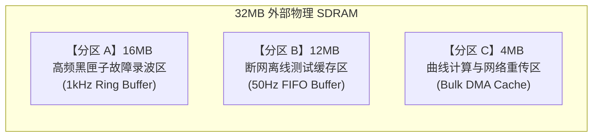

# GD32F470 分布式测功机控制系统软件需求规格说明书 (SRS)

## 1. 项目概述与系统拓扑架构

### 1.1 项目背景
本系统是基于 **GD32F470ZGT6** 主控芯片的分布式测功机（Dynamometer）控制器，专门用于电动工具（手持电钻、角磨机、电锯、螺丝刀等）及通用电机（直流电机、交流电机、BLDC）的性能测试、外特性曲线自动绘制与故障极限摸底。

### 1.2 系统拓扑架构
系统采用 **“边缘节点控制 + 中央节点调度与监视”** 的分布式工业架构：
- **边缘控制节点（GD32F470 下位机）**：每台测功机台架配备一块控制器，独立运行 FreeRTOS 实时操作系统，负责高速传感器采样、本地 PID 闭环控制算法、压控恒流源驱动、SDRAM 黑匣子录波及本地安全硬件保护。
- **中央控制节点（上位机 / 控制台服务器）**：通过局域网以太网（TCP/IP）与多个下位机节点建立连接，负责下发测试任务、接收并存储高频遥测数据、实时绘制测试曲线以及集中报警监视。
- **本地操作接口（RS485-1）**：连接台架本地触摸屏（HMI），提供就地查看数据与手动操作面板。
- **外部用户接口（RS485-2）**：预留给外部客户的 PLC 或测试系统进行第三方数据读取与控制。

```mermaid
graph TD
    subgraph 中央控制节点 (Server / Upper Computer)
        Server["中央控制台 (任务调度 / 数据存储 / 曲线绘制 / 状态监视)"]
    end

    subgraph 局域网以太网 (TCP/IP Network)
        Switch["工业以太网交换机"]
    end

    subgraph 现场交互与外部系统
        HMI["现场触摸屏 (HMI - RS485-1)"]
        UserPLC["外部用户系统 (PLC / PC - RS485-2)"]
    end

    subgraph 边缘控制节点 (GD32F470 台架)
        MCU["GD32F470 核心主控"]
        SDRAM["外部 32MB SDRAM (W9825G6KH)"]
        VCCP["压控恒流源 (VCCP)"]
        Dyno["测功机负载制动器"]
        Relay["主电源控制继电器"]
        Tool["被测电动工具 / 电机"]
    end

    Server <==> Switch
    Switch <==> MCU
    HMI <-->|RS485-1 (Modbus RTU 从机)| MCU
    UserPLC <-->|RS485-2 (外部开放接口)| MCU

    MCU <-->|EXMC 高速总线| SDRAM
    MCU -->|PA4 DAC (0~3.3V)| VCCP --> Dyno
    MCU -->|GPIO 输出| Relay --> Tool
```

---

## 2. 硬件接口与外设分配定义

| 硬件模块 / 芯片型号 | 通信接口 / MCU 引脚 | 硬件职责与物理量定义 |
| :--- | :--- | :--- |
| **CS1237 (24-bit ADC)** | PC3 (SCLK), PC2 (DOUT) | **扭矩/拉力测量**：采集称重/扭矩传感器信号，计算实际转矩 $T (N\cdot m)$ |
| **CS1238 (24-bit 双通道 ADC)** | PD0 (SCLK), PD1 (DOUT) | **直流电参量测量**：通道 1 采集直流电压 $U_{dc} (V)$，通道 2 采集直流电流 $I_{dc} (A)$ |
| **HLW8112 (单相计量芯片)** | PB5(CS), PB6(CLK), PB7(SDI), PB8(SDO), PB9(EN) | **交流电参量测量**：采集交流有效电压 $U_{ac} (V)$、有效电流 $I_{ac} (A)$、有功功率 $P_{ac} (W)$、功率因数 $PF$ 及电网频率 $Hz$ |
| **TIM 脉冲捕获 / 编码器** | 定时器输入通道 | **转速测量**：捕获光电/磁编码器脉冲，计算实际转速 $n (RPM)$ |
| **DAC 输出 (DAC0_OUT0)** | PA4 (模拟输出 0~3.3V) | **负载驱动控制**：输出模拟电压给**压控恒流源 (VCCP)**，恒流源输出电流直接控制制动器的加载扭矩 |
| **外部 SDRAM (W9825G6KH-6I)** | EXMC 外部存储器总线 (16位宽) | **高速数据存储**：容量 32MB (256Mbit)，用于**毫秒级故障黑匣子录波**与**断网离线无损缓存** |
| **以太网 PHY (LAN8720/LAN8702)** | RMII 接口 (PA1, PA2, PA7, PC1, PC4, PC5, PB11, PB12, PB13) | **局域网主通信**：基于 LwIP 协议栈运行 TCP Client，与中央控制台高速双向交互 |
| **RS485 通道 1 (HMI 屏)** | 硬件串口 1 + 独立方向控制 IO | **本地触摸屏交互**：运行 Modbus RTU 从机协议，供操作员就地监视与操作 |
| **RS485 通道 2 (外部用户)** | 硬件串口 2 + 独立方向控制 IO | **外部用户开放接口**：独立硬件通道与站号，开放给客户 PLC 或自研测试设备 |
| **主电源继电器控制** | 推挽输出 GPIO | **被测工具供电控制**：控制被测工具/电机的交直流供电主接触器通断 |

---

## 3. 外部 32MB SDRAM 内存分区与存储子系统规范

### 3.1 芯片容量确认
芯片型号为 **W9825G6KH-6I**，容量规格为 **256Mbit = 32MByte (32MB)**，16 位数据总线，工作主频最高支持 166MHz。

### 3.2 内存空间分区规划 (32MB Partitioning)



### 3.3 分区详细功能说明

#### 1. 高频黑匣子故障录波系统 (分区 A - 16MB)
- **录波机制**：单片机内部以 **1kHz (1ms 周期)** 持续将底层采集的原始扭矩、转速、直流电流、交流有效值等原始点写入 16MB 环形队列（Ring Buffer），无感覆盖旧数据。
- **容量指标**：每个采样点约 32 字节，$16\text{MB} \div 32\text{KB/s} \approx \mathbf{512\text{ 秒} \approx 8.5\text{ 分钟}}$ 连续原始波形。
- **事件冻结触发**：
  - 当触发**超扭矩、超温、超速、堵转报警，或按下/下发急停指令**时；
  - 单片机立刻锁存“**故障前 30 秒 + 故障后 10 秒**”（共约 40 秒，尺寸约 1.28MB）作为一次独立的**故障波形文件 (Fault Dump)**。
  - 16MB 空间至少可保留 **10 次以上**严重事故的高精录波，支持上位机后续以示波器形式逐毫秒回溯事故瞬间。

#### 2. 断网离线测试零丢失缓存系统 (分区 B - 12MB)
- **断网暂存机制**：若以太网 TCP 发生物理断开或网络超时，单片机并不中断正在执行的合规测试，而是将每包 56 字节的 50Hz 遥测数据以 FIFO 队列形式写入 12MB 离线缓存池。
- **容量指标**：$12\text{MB} \div (50\text{Hz} \times 56\text{ 字节}) \approx \mathbf{4388\text{ 秒} \approx 73\text{ 分钟} (1.2\text{ 小时})}$。
- **极速断点补录 (Burst Sync)**：当以太网重新握手成功后，单片机向中心节点上报“未同步离线数据包数量”。中心节点发送拉取指令后，单片机以网络最大吞吐量启动突发回传，保证实验测试报告完整无缺。

#### 3. 动态运算与大块传输缓冲 (分区 C - 4MB)
- 用于单片机本地就地拟合 $T-n$ 曲线拐点、极值点，以及充当以太网大块数据分包发送的 DMA 物理缓冲区。

---

## 4. 多接口控制权仲裁与安全互斥机制

系统拥有 **以太网 (TCP)**、**485-1 (触摸屏)**、**485-2 (外部用户)** 三个控制入口，为防止多端并发冲突，必须建立严格的权限仲裁：

```mermaid
graph TD
    subgraph 控制接口
        ETH["以太网中心节点 (REMOTE_ETH)"]
        HMI["485-1 本地触摸屏 (LOCAL_HMI)"]
        USER["485-2 外部用户 (EXT_USER)"]
    end

    subgraph 仲裁中心 (Control Arbiter)
        Check{"当前控制权持有者?"}
        Allow["允许修改测试模式 / 目标加载值"]
        Reject["拒绝修改并返回锁定状态 (只读监控)"]
        ESTOP["【绝对最高权限】立即执行'先软卸载后断电'!"]
    end

    ETH --> Check
    HMI --> Check
    USER --> Check

    Check -->|来源匹配| Allow
    Check -->|来源不匹配| Reject

    ETH -.->|急停指令| ESTOP
    HMI -.->|急停按钮| ESTOP
    USER -.->|急停指令| ESTOP
```

### 4.1 权限规则
1. **控制权独占**：
   - 默认为 `LOCAL_HMI`（本地触摸屏控制）。
   - 中心节点下发“启动测试任务”后，系统锁定为 `REMOTE_ETH`。
   - 处于远控期间，触摸屏与外部 485 接口**降级为只读监控模式**，任何改动设定值的操作均被下位机拒绝并提示“远程控制中”。
2. **急停（E-Stop）全局最高无条件响应**：
   - 无论是以太网、触摸屏急停按键，还是外部用户 485 指令，**急停不经过任何权限检查**，任何接口发出急停，单片机立刻以最高优先级切入急停保护。

---

## 5. 两路 RS485 硬件接口分工与协议规范

### 5.1 RS485 通道 1（本地工业触摸屏 HMI）
- **角色**：单片机作为 **Modbus RTU 从机 (Slave)**，默认站号 `0x01`，波特率 `115200 8-N-1`。
- **寄存器映射**：
  - **输入寄存器 (0x04)**：只读映射实时扭矩、转速、直流电压/电流、交流电压/电流/功率、当前模式与系统报警状态字。
  - **保持寄存器 (0x03 / 0x06 / 0x10)**：读写控制工作模式、设定目标值、手动 DAC 调节量、启动/停止及急停控制。

### 5.2 RS485 通道 2（外部用户开放接口）
- **角色**：单片机作为 **独立 Modbus RTU 从机**，独立硬件串口，默认站号 `0x02`。
- **功能**：与通道 1 共享数据池，提供给外部第三方设备（如客户自己的自动化产线 PLC、老化柜监控机）读取测试数据与进行联动控制。

---

## 6. 测试模式与调控算法需求

单片机在 100Hz 控制任务中独立完成以下 7 大工作模式的调控与状态机转移：

### 6.1 模式列表

| 测试模式 | 调控目标 | 反馈源 | 调控机制 |
| :--- | :--- | :--- | :--- |
| **恒扭矩 (`CONST_TORQUE`)** | 保持负载扭矩恒定 | CS1237 扭矩值 $T (N\cdot m)$ | 增量式 PID，扭矩偏小时提高 DAC，偏大时降低 DAC |
| **恒转速 (`CONST_SPEED`)** | 保持工具输出转速恒定 | TIM 脉冲捕获 $n (RPM)$ | PID 调节，转速过高时增加 DAC 增大负载，反之减小 |
| **恒输出功率 (`CONST_POUT`)** | 保持机械输出功率恒定 | $P_{mech} = \frac{T \times n}{9.549}$ (W) | PID 闭环调节压控恒流源 |
| **恒输入功率 (`CONST_PIN`)** | 保持工具输入电功率恒定 | **AC**：HLW8112 $P_{ac}$<br>**DC**：CS1238 $P_{dc} = U \times I$ | PID 闭环调节输入端电功率 |
| **开放式手动加载 (`MANUAL`)** | 人工任意连续调控阻力 | 无（开环或直跟） | 上位机下发 DAC 电压/百分比，**带平滑斜率防机械冲击限制** |
| **自动曲线扫描 (`SWEEP`)** | 自动绘制外特性曲线/堵转 | 按照预设计划曲线 | 本地执行步进/斜坡自动加载（Ramp），完成升降速及堵转扫描 |
| **紧急停止 (`ESTOP`)** | 系统最高安全保护 | 硬件/软件急停触发 | 强制 DAC 归 0V，断开主继电器供电，锁死系统 |

### 6.2 开放式手动模式防冲击设计（平滑斜率限制）
在手动模式下，即使上位机用户猛拉滑块（如突然从 0% 拖至 100%），单片机内部实施**输出斜率限制（Slew Rate Limiting）**：
$$\left|\frac{\Delta V_{dac}}{\Delta t}\right| \le \text{Slew\_Rate\_Limit} \quad (\text{默认 } 2.0\text{V/s})$$
确保负载电流平滑爬升，坚决消除机械冲击与断齿风险。

---

## 7. 通信协议体系规范 (TCP Client + 大块传输)

### 7.1 数据帧结构 (以太网二进制帧)

| 偏移 (Bytes) | 字段名 | 类型 | 说明 |
| :---: | :--- | :---: | :--- |
| `0 ~ 1` | **Header** | `uint16_t` | 固定同步字 `0x55 0xAA` |
| `2` | **DevID** | `uint8_t` | 节点设备编号 (`0x01 ~ 0xFE`) |
| `3` | **Cmd ID** | `uint8_t` | 功能码 |
| `4` | **Seq** | `uint8_t` | 帧序号 (`0x00 ~ 0xFF` 循环递增) |
| `5 ~ 6` | **Length** | `uint16_t` | Payload 长度 (大端 Big-Endian) |
| `7 ~ N` | **Payload** | `bytes` | 业务有效载荷 (小端 Little-Endian) |
| `N+1 ~ N+2` | **CRC16** | `uint16_t` | Standard CRC16-Modbus |

### 7.2 功能码体系与数据包定义

#### 1. 50Hz 高频遥测数据包 (Cmd `0x01`：单片机 $\rightarrow$ 中心节点，56 字节)
```c
#pragma pack(push, 1)
typedef struct {
    uint32_t timestamp_ms;    /* 系统时间戳 (ms) */
    uint8_t  tool_type;       /* 工具类型: 0-直流 DC, 1-交流 AC */
    uint8_t  work_mode;       /* 当前模式: Idle, Manual, Const_T, Const_N, Const_Pout, Const_Pin, Sweep, EStop */
    uint16_t system_status;   /* 状态与报警字 (Bit0:超扭矩, Bit1:超速, Bit2:断电中, Bit3:急停) */

    /* 机械参量 */
    float    torque_nm;       /* 实际扭矩 (N.m) - CS1237 */
    float    speed_rpm;       /* 实际转速 (RPM) - TIM 捕获 */
    float    mech_power_w;    /* 机械输出功率 (W) */

    /* 直流电参量 - CS1238 */
    float    dc_voltage_v;    /* 直流电压 (V) */
    float    dc_current_a;    /* 直流电流 (A) */
    float    dc_power_w;      /* 直流输入功率 (W) */

    /* 交流电参量 - HLW8112 */
    float    ac_voltage_v;    /* 交流有效电压 (V) */
    float    ac_current_a;    /* 交流有效电流 (A) */
    float    ac_power_w;      /* 交流有功功率 (W) */
    float    power_factor;    /* 功率因数 PF */

    /* 控制与效率 */
    float    efficiency_pct;  /* 系统总效率 (%) */
    float    dac_voltage;     /* 当前 DAC 输出电压 (V) */
    float    target_setpoint; /* 当前目标设定值 */
} node_telemetry_packet_t;
#pragma pack(pop)
```

#### 2. 即时控制指令集
- **`0x10`**：下发测试任务与工作模式（设定目标值、工具类型）。
- **`0x11`**：紧急停止 (E-Stop)。
- **`0x12`**：设定 PID 参数（$K_p, K_i, K_d$ 及输出上限）。
- **`0x15`**：手动加载微调与滑动控制指令。

#### 3. SDRAM 大块传输指令集 (Bulk Transfer)
- **`0x30`**：查询断网离线缓存记录总数与时间范围。
- **`0x31`**：请求启动断点批量数据续传 (Burst Sync)。
- **`0x32`**：分包回传离线数据包（每包 1024 字节高效灌入上位机）。
- **`0x40`**：查询黑匣子故障事件列表（故障类型、发生时间戳）。
- **`0x41`**：下载指定故障事件前后的 1kHz 毫秒级原始波形数据。

---

## 8. 安全保护与故障响应机制

### 8.1 网络中断“先软卸载，后断电”二阶段序列
当单片机检测到 TCP 断连或心跳超时超过预设安全窗口时：
1. **阶段一（软件平滑卸载）**：PA4 DAC 输出在 **100~200ms 内平滑降至 0.0V**，迅速释放制动器加载电流与磁场阻力，消除高速旋转下的剧烈机械冲击与反电动势。
2. **阶段二（切断主电源）**：检测到实际扭矩安全释放后，单片机控制继电器 GPIO **断开被测工具/电机的供电电源**。
3. **阶段三（安全锁定）**：状态机切入 `DYNO_MODE_ESTOP` 状态。

```mermaid
graph LR
    NetDrop[网络中断/超时] --> Phase1[阶段一: DAC 平滑归零卸载 (100ms)]
    Phase1 --> Phase2[阶段二: GPIO 动作切断主电源]
    Phase2 --> Phase3[阶段三: 切入 E-STOP 安全锁死]
```

### 8.2 软硬件双重防护
- **全局 DAC 硬件封顶限制**：设置安全物理上限 `max_dac_limit`（如 2.8V），任何模式绝对无法越限输出。
- **超扭矩 / 超转速 / 堵转超时保护**：一旦越过安全红线，立刻执行两阶段卸载断电程序并触发黑匣子毫秒级录波。

---

## 9. 通用电机测试兼容性设计

系统底层对传感器与控制算法进行了全面解耦：
1. **电参量计算引擎抽象**：直流工具/电机选择 $P_{in} = U_{dc} \times I_{dc}$，交流工具/单相电机选择 $P_{in} = P_{ac}$，未来扩展三相电机测试仅需扩展数据采集通道。
2. **算法接口标准化**：PID 算法接口采用通用数学结构，反馈源按需绑定（扭矩、转速、功率或母线电流），保证代码架构平滑支持未来工业电机的出厂检验与标定。
