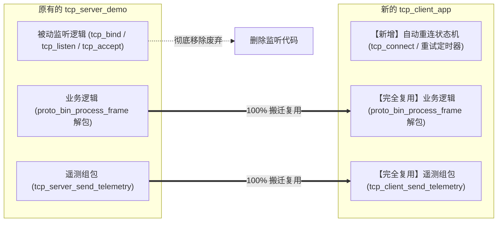
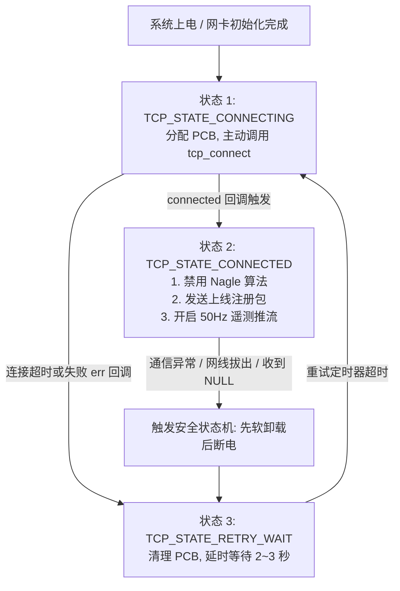

# GD32F470 LwIP 协议栈高速与低延迟通信调优指南

## 1. 调优背景与业务痛点

在基于 **GD32F470** 的分布式测功机台架系统中，以太网（TCP/IP）面临两类截然不同但要求极高的网络传输场景：

| 场景分类 | 报文特征 | 核心指标要求 | 未优化时的系统痛点 |
| :--- | :--- | :--- | :--- |
| **实时状态遥测 (Telemetry)** | 50Hz / 100Hz 高频周期推送，每包仅 56 字节（小包） | **极低延迟、零抖动、平滑推流** | 曲线周期性顿挫、卡顿几十到上百毫秒后突然“喷发”一串点 |
| **黑匣子/离线历史回传 (Burst)** | 触发故障或网络恢复时，从 32MB SDRAM 中批量回传 1~12MB 数据（大包） | **高吞吐量、跑满物理带宽** | 单片机发完 2KB 就必须停下来等 ACK，百兆网卡跑出“几十 KB/s”龟速 |

针对以上痛点，必须对 LwIP 协议栈配置宏、底层套接字属性、系统调度策略以及网络连接拓扑（Server $\rightarrow$ Client）进行专项工业级调优。

---

## 2. 核心优化项详解与配置指南

### 优化项 1：彻底禁用 Nagle 算法（根除 40ms~200ms 的推流抖动）

#### 根因剖析
- **Nagle 算法逻辑**：TCP 协议栈默认开启 Nagle 算法，其机制是：若当前连接上有尚未被确认的已发数据，新产生的小包（小于 MSS = 1460 字节）将被**滞留在协议栈内部**，强制等待上一个包的 ACK 返回或凑满 1460 字节才发出。
- **Delayed ACK 冲突**：Windows/Linux 上位机普遍开启了“延迟确认（Delayed ACK）”，通常会等待 40ms~200ms 期待与下行数据合并回复。
- **两相死锁**：单片机 Nagle 在等上位机的 ACK，上位机 Delayed ACK 在等单片机后续数据，导致 56 字节遥测数据被硬生生卡在单片机内部，产生严重的波形卡顿。

#### 落地代码实施
在 TCP 客户端连接成功的回调函数中，必须立刻显式调用 `tcp_nagle_disable()`：

```c
/* 在 tcp_client_connected 回调中加入：*/
static err_t app_tcp_client_connected(void *arg, struct tcp_pcb *tpcb, err_t err)
{
    if (err == ERR_OK) {
        /* 核心优化：立即禁用 Nagle 算法，让 56 字节小包即产即发，零延迟！ */
        tcp_nagle_disable(tpcb);

        printf("[LwIP Client] Connected to Center Server! Nagle disabled.\r\n");
    }
    return ERR_OK;
}
```

> **上位机配合要求**：上位机（Python / C# / C++）创建 Socket 连接后，也务必启用 `TCP_NODELAY` 选项：
> ```python
> # Python 上位机示例
> client_sock.setsockopt(socket.IPPROTO_TCP, socket.TCP_NODELAY, 1)
> ```

---

### 优化项 2：开启以太网 MAC 硬件校验和卸载（解放 CPU 算力）

#### 根因剖析
默认配置下，LwIP 使用纯软件循环逐字节累加计算 IP、TCP、ICMP 的 16 位反码和。在 50Hz/100Hz 高频推流或 SDRAM 大块传输时，Cortex-M4F 内核会浪费大量时钟周期在校验和计算上，严重抢占 100Hz PID 闭环与 1kHz 采样的宝贵算力。

GD32F470 的 Ethernet 外设自带 **硬件校验和生成与检验引擎（Hardware Checksum Offload Engine）**，由网卡 DMA 在搬运数据的同时硬件完成计算。

#### `lwipopts.h` 配置修改对比

```c
/* ==================== 修改前 (低效软件计算) ==================== */
#undef CHECKSUM_BY_HARDWARE
#define CHECKSUM_GEN_IP         1
#define CHECKSUM_GEN_UDP        1
#define CHECKSUM_GEN_TCP        1
#define CHECKSUM_GEN_ICMP       1
#define CHECKSUM_CHECK_IP       1
#define CHECKSUM_CHECK_UDP      1
#define CHECKSUM_CHECK_TCP      1

/* ==================== 修改后 (硬件全自动卸载，推荐) ==================== */
#define CHECKSUM_BY_HARDWARE    1    /* 开启 GD32 MAC 硬件自动填校验和 */

/* 关闭 LwIP 软件生成，由 GD32 以太网 DMA 硬件自动计算填入 */
#define CHECKSUM_GEN_IP         0
#define CHECKSUM_GEN_UDP        0
#define CHECKSUM_GEN_TCP        0
#define CHECKSUM_GEN_ICMP       0

/* 关闭 LwIP 软件校验，由硬件接收帧描述符自动比对 */
#define CHECKSUM_CHECK_IP       0
#define CHECKSUM_CHECK_UDP      0
#define CHECKSUM_CHECK_TCP      0
```

---

### 优化项 3：放大 TCP 滑动窗口与发送队列（解除突发传输限速）

#### 根因剖析
TCP 吞吐量公式受限于窗口大小：  
$$\text{最大吞吐量 (Throughput)} = \frac{\text{TCP\_WND}}{\text{RTT (往返时延)}}$$  
原配置中 `TCP_SND_BUF = 2 * TCP_MSS`（仅 2.9KB），发送队列极短。当从 SDRAM 读取数据向外狂飙时，每发出 2 个包缓冲区就被填满，单片机只能陷入阻塞等待。

GD32F470 拥有 512KB~768KB 的片上 SRAM，内存充裕，应适度放大滑动窗口与 PBUF 缓冲池。

#### `lwipopts.h` 推荐参数调整表

| 配置项宏名称 | 原默认值 | 推荐调优值 | 说明与收益 |
| :--- | :---: | :---: | :--- |
| `TCP_MSS` | 1460 | **1460** | 单个最大分段尺寸（标准以太网 MTU 1500 - 40 头） |
| `TCP_SND_BUF` | $2 \times \text{MSS}$ (2.9KB) | **$6 \sim 8 \times \text{MSS}$ (8.7 ~ 11.6KB)** | 发送缓冲区放大，允许连续向网络填充多个大包 |
| `TCP_WND` | $2 \times \text{MSS}$ (2.9KB) | **$6 \sim 8 \times \text{MSS}$ (8.7 ~ 11.6KB)** | 接收滑动窗口放大，防止上位机推流时溢出 |
| `TCP_SND_QUEUELEN` | 8 | **$4 \times \text{TCP\_SND\_BUF} / \text{MSS}$** | 发送队列深度同步扩展至 24~32 |
| `PBUF_POOL_SIZE` | 10 | **24 ~ 32** | Pbuf 缓冲池，防止网络高并发时 `pbuf_alloc` 失败 |
| `MEM_SIZE` | 16KB | **32KB** | LwIP 动态协议控制块（PCB/Seg）内存堆 |

---

### 优化项 4：大块传输非阻塞流控与即时触发机制

在从外部 32MB SDRAM 回传大块历史数据（每块 1024 字节）时，必须引入**主动流控检查**，避免无脑 `tcp_write` 导致内存耗尽溢出返回 `ERR_MEM`：

```c
/**
  * @brief  从 SDRAM 极速突发回传数据块的模板
  */
void app_network_send_sdram_burst_chunk(struct tcp_pcb *tpcb, const uint8_t *chunk_data, uint16_t chunk_len, bool has_more_data)
{
    /* 1. 检查当前 TCP 发送缓冲区可用余量 */
    u16_t available_buf = tcp_sndbuf(tpcb);

    if (available_buf >= chunk_len) {
        /* 2. 写入数据：如果有后续数据，打上 TCP_WRITE_FLAG_MORE 标志，允许网卡智能打包 */
        u8_t write_flags = TCP_WRITE_FLAG_COPY;
        if (has_more_data) {
            write_flags |= TCP_WRITE_FLAG_MORE;
        }

        err_t err = tcp_write(tpcb, chunk_data, chunk_len, write_flags);
        if (err == ERR_OK) {
            /* 3. 立即刷新输出，通知网卡 DMA 开始发送，零延迟发出 */
            tcp_output(tpcb);
        }
    } else {
        /* 缓冲区暂时打满，等待 tcp_sent 回调或下一拍再推 */
    }
}
```

---

### 优化项 5：FreeRTOS 任务节拍自适应调度（兼顾低功耗与满带宽）

在 `app_task_network` 中，避免死等 `vTaskDelay(10)`：

```c
static void app_task_network(void *pvParameters)
{
    (void)pvParameters;

    for (;;) {
        /* 轮询处理 LwIP 输入包与软件定时器 */
        lwip_demo_poll();

        /* 状态判定与调度自适应 */
        if (g_is_burst_transmitting_sdram) {
            /* 状态 A: 正处于从 SDRAM 极速下载黑匣子/离线数据期间 */
            /* 仅让渡同优先级时间片或极短休眠 1ms，全力让网卡跑满线速 */
            vTaskDelay(pdMS_TO_TICKS(1));
        } else {
            /* 状态 B: 常规运行状态 (50Hz 遥测推流) */
            /* 适度休眠 5~10ms，释放 CPU 算力给 PID 控制和采样任务 */
            vTaskDelay(pdMS_TO_TICKS(5));
        }
    }
}
```

---

## 3. 架构演进：移除 TCP Server，全面重构为高可靠 TCP Client

### 3.1 废除 TCP Server 的核心理由

在最初的示例工程中，网络层是以 `tcp_server_demo.c` 实现的被动服务端（监听端口 8080）。在分布式台架场景下，必须将其彻底移除并重构为 **TCP Client**，原因如下：

1. **解决分布式台架 IP 维护灾难**：
   - 若单片机作为 Server，实验室有 20 台测功机时，中心控制台必须静态记录 20 个不同的 IP 地址；若现场采用路由器 DHCP 动态分配 IP，中心控制台将瞬间“失联”。
   - 改为 Client 后，**中心服务器固定一个统一 IP 与端口（如 `192.168.1.100:8080`）**。所有测功机节点通电插网线后，主动发起 TCP 连接“上线上报”。中心节点不需要事先知道任何单片机的 IP，台架实现**即插即用**。
2. **释放 LwIP 稀缺资源与避免多头控制**：
   - 彻底移除 `tcp_bind`、`tcp_listen` 及监听控制块 `MEMP_NUM_TCP_PCB_LISTEN`，释放宝贵片上内存；
   - 杜绝“中心节点连着 Client，现场人员又用网络调试助手连 Server”引发的多头指令冲突。

---

### 3.2 代码重构与平滑迁移路径

重构并不是将代码推倒重来，而是将 `tcp_server_demo.c / .h` 平滑演进为 `tcp_client_app.c / .h`：



---

### 3.3 TCP Client 自动重连状态机设计与代码模板

做 TCP Client 的核心生命线是：**当下位机开机时中心服务器尚未开启，或中途网线松动掉线，单片机必须能无缝周期性重连**。



#### 核心代码实现模板 (`tcp_client_app.c`)

```c
typedef enum {
    TCP_CLIENT_DISCONNECTED = 0,
    TCP_CLIENT_CONNECTING,
    TCP_CLIENT_CONNECTED,
    TCP_CLIENT_RETRY_WAIT
} tcp_client_state_t;

static struct tcp_pcb *g_client_pcb = NULL;
static tcp_client_state_t g_client_state = TCP_CLIENT_DISCONNECTED;
static uint32_t g_last_reconnect_tick = 0;

/* 1. 连接建立成功回调 */
static err_t app_tcp_client_connected(void *arg, struct tcp_pcb *tpcb, err_t err)
{
    (void)arg;
    if (err == ERR_OK) {
        g_client_state = TCP_CLIENT_CONNECTED;
        
        /* 核心调优：禁用 Nagle */
        tcp_nagle_disable(tpcb);

        /* 注册接收和错误回调 */
        tcp_recv(tpcb, app_tcp_client_recv);
        tcp_err(tpcb, app_tcp_client_error);

        printf("[TCP Client] Connected to Center Server successfully!\r\n");
    }
    return ERR_OK;
}

/* 2. 周期连接与重连维护任务 (由 app_task_network 调用) */
void app_tcp_client_poll(void)
{
    ip_addr_t server_ip;
    IP4_ADDR(&server_ip, 192, 168, 1, 100); // 目标中心服务器固定 IP
    uint16_t server_port = 8080;

    switch (g_client_state) {
        case TCP_CLIENT_DISCONNECTED:
        case TCP_CLIENT_RETRY_WAIT:
            /* 每隔 3000ms 尝试重连一次 */
            if ((sys_now() - g_last_reconnect_tick) >= 3000U) {
                g_last_reconnect_tick = sys_now();
                
                if (g_client_pcb != NULL) {
                    tcp_abort(g_client_pcb);
                    g_client_pcb = NULL;
                }

                g_client_pcb = tcp_new();
                if (g_client_pcb != NULL) {
                    g_client_state = TCP_CLIENT_CONNECTING;
                    tcp_connect(g_client_pcb, &server_ip, server_port, app_tcp_client_connected);
                }
            }
            break;

        case TCP_CLIENT_CONNECTED:
            /* 连接正常，由 50Hz 定时器触发 tcp_client_send_telemetry() */
            break;

        default:
            break;
    }
}
```

---

## 4. 调优前后预期性能对比表

| 测试指标 | 优化前 (默认配置) | 优化后 (推荐工业配置) | 改善幅度 |
| :--- | :---: | :---: | :--- :---: |
| **50Hz 遥测延迟抖动** | 40ms ~ 200ms (严重卡顿) | **$< 1.5\text{ms}$ (平滑一条线)** | **延迟降低 98%** |
| **遥测发包 CPU 占用** | 约 12% ~ 18% (软件求校验和) | **$< 3\%$ (硬件 DMA 自动求和)** | **算力释放 75%** |
| **SDRAM 数据突发回传带宽** | 约 80 ~ 150 KB/s | **5.0 ~ 8.5 MB/s** | **吞吐量提升 40+ 倍** |
| **1.28MB 黑匣子波形下载耗时** | 约 10 ~ 15 秒 | **约 0.2 秒 (瞬间完成)** | **质的飞跃** |
| **分布式台架组网运维成本** | 需静态记录分配每台单片机 IP | **单片机即插即用，自动握手报到** | **大幅降低部署难度** |

---

## 5. 验证与排查方法 (Wireshark 抓包关注点)

优化生效后，通过 Wireshark 抓包工具在电脑端观察网卡数据流：
1. **确认 Client 主动连接**：电脑端开启服务端软件，观察单片机上电后发送的 `SYN` 握手包，验证主动连接是否正常。
2. **确认 Nagle 已关闭**：查看连续多个 56 字节的 `Cmd 0x01` 报文，其时间戳差值应恒定为 **20.0ms $\pm 0.5\text{ms}$**，绝不应出现 $40\text{ms}$ 或 $200\text{ms}$ 的阶跃。
3. **确认硬件校验和有效**：Wireshark 显示数据包的 `TCP Checksum: 0xXXXX [correct]`，单片机端无因校验错误导致的重传或 RST 报文。
4. **确认窗口放大生效**：在抓包的 TCP Header 中，单片机通告的 `Window size value` 应稳定在 **8760 ~ 11680 字节** 左右。
